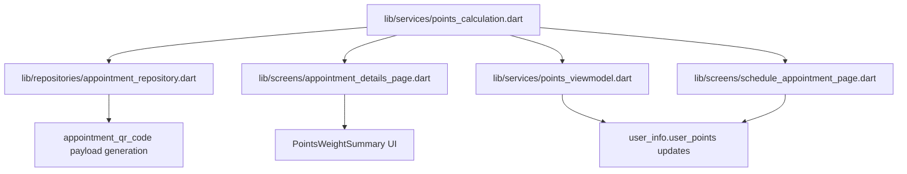

# UC-04 Dependency & Impact Analysis (Greptile Demo)

This PR turns `lib/services/points_calculation.dart` into a true shared core and routes multiple modules through it.

## Shared Core

- `lib/services/points_calculation.dart`

## Direct Dependency Map

## Function-Level Relationships

- `calculateMaterialPoints(weightKg, pointsPerKg)`
  - Used by `lib/repositories/appointment_repository.dart`
  - Used by `lib/screens/appointment_details_page.dart`
- `extractPointsFromQrPayload(qrPayload)`
  - Used by `lib/services/points_viewmodel.dart`
- `EcoPointsConstants.scheduleConfirmationBonusPoints`
  - Used by `lib/screens/schedule_appointment_page.dart`

## Proposed-Change Impact Examples

1. Change QR parsing behavior in `extractPointsFromQrPayload`
   - Immediate impact: `lib/services/points_viewmodel.dart`
   - Transitive impact: points crediting flow after QR scan, user balance updates, points-related UI

2. Change material point math in `calculateMaterialPoints`
   - Immediate impact: `lib/repositories/appointment_repository.dart`, `lib/screens/appointment_details_page.dart`
   - Transitive impact: QR payload `Points:` value, appointment points summary UI

3. Change `EcoPointsConstants.scheduleConfirmationBonusPoints`
   - Immediate impact: `lib/screens/schedule_appointment_page.dart`
   - Transitive impact: persisted `user_info.user_points`, success dialog text

## Why This Satisfies UC-04

- Files now clearly depend on one shared core module.
- A change to a core function produces predictable downstream impact in repository, service, and screen layers.
- The Mermaid graph can be used directly in PR discussion for dependency visualization.
